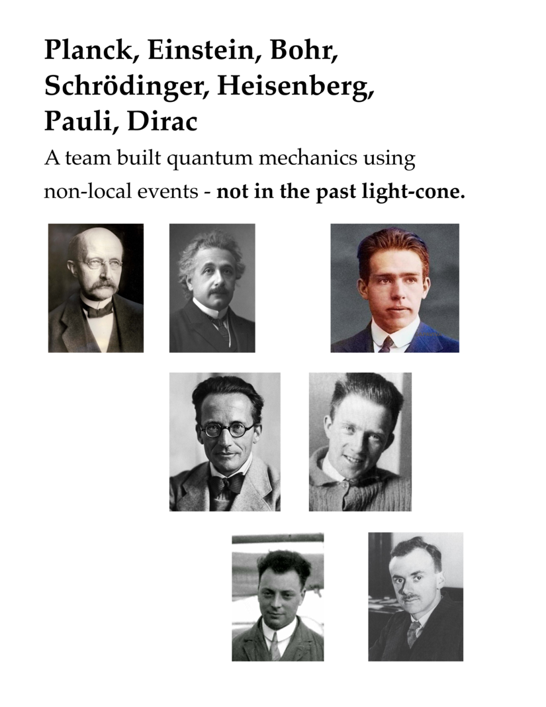
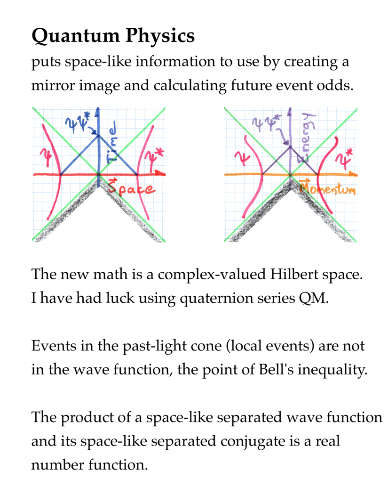

# The Diversity of Time's Relationship with Space using Quaternions

Poster for the April APS Meeting, 2020

5 minute YouTube video

  <iframe width="640" height="360" src="https://www.youtube.com/embed/2LsomIZH1Ao" frameborder="0" allowfullscreen></iframe>

[8 page PDF](pdfs/diversities_in_times_relationship_to_space.pdf)

8 slides.

Doug Sweetser
sweetser@alum.mit.edu
