# Special Relativity in Space-Time and Gravity in its Tangent Space Energy-Momentum

## 24' Talk

  <iframe width="640" height="360" src="https://www.youtube.com/embed/jIe4vQUVefM" frameborder="0" allowfullscreen></iframe>

## [15 page PDF](Gravity_in_energy-momentum_v2.pdf)

## 15 Slides

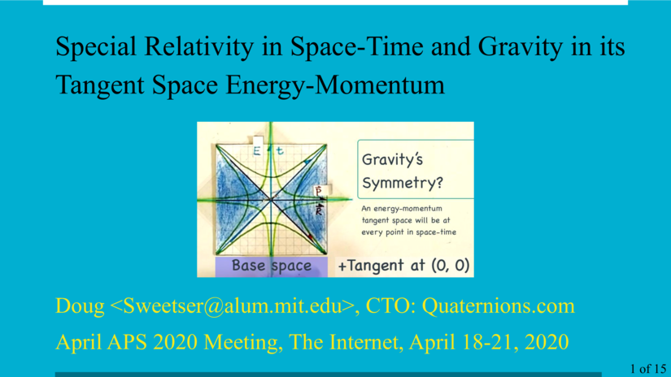
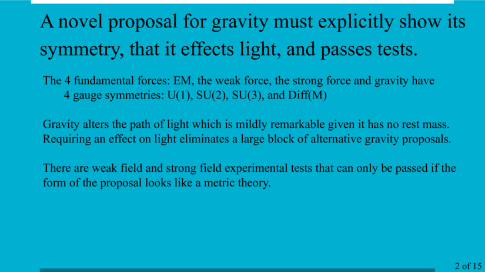
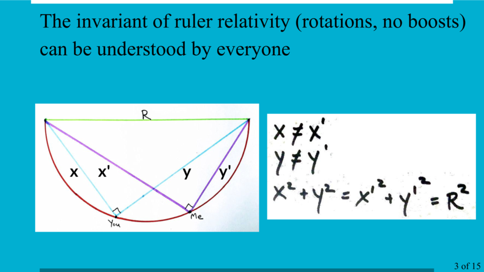
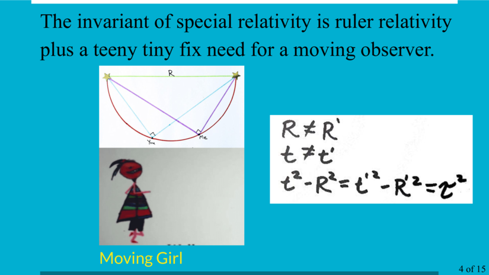
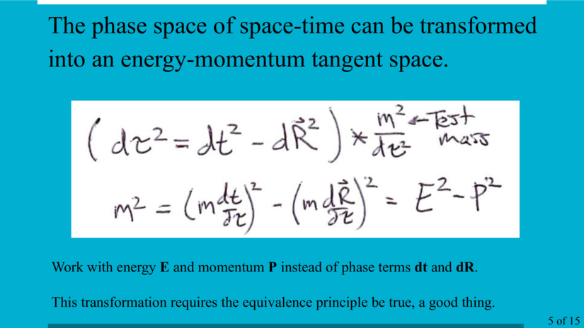
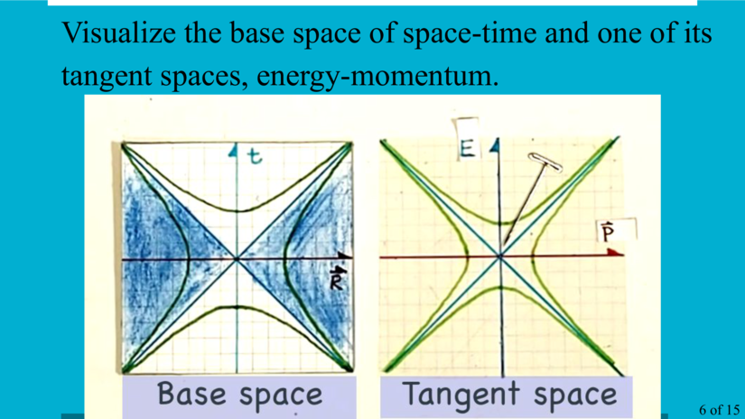
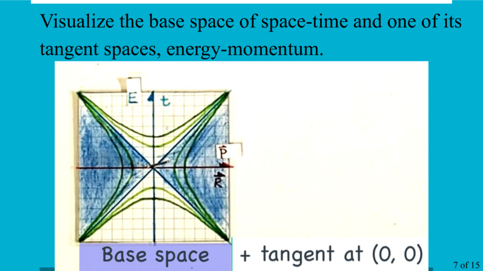
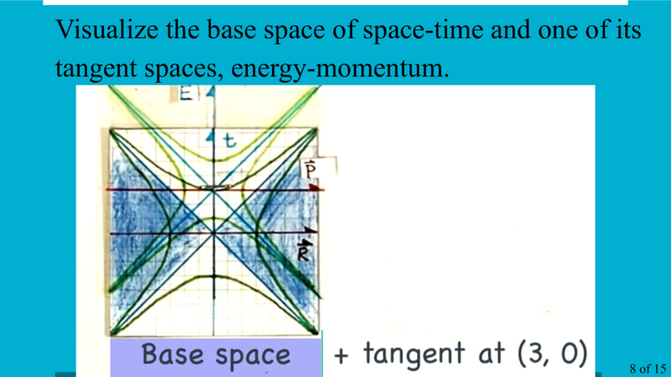
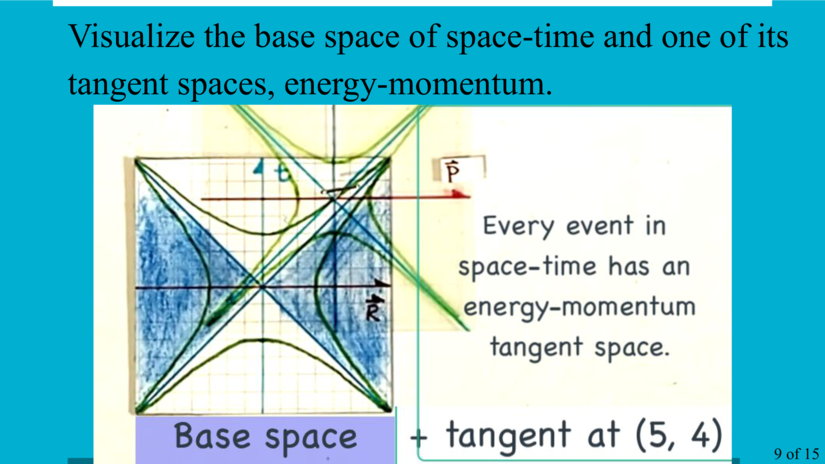
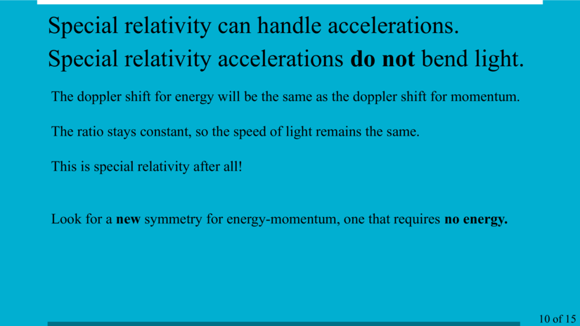
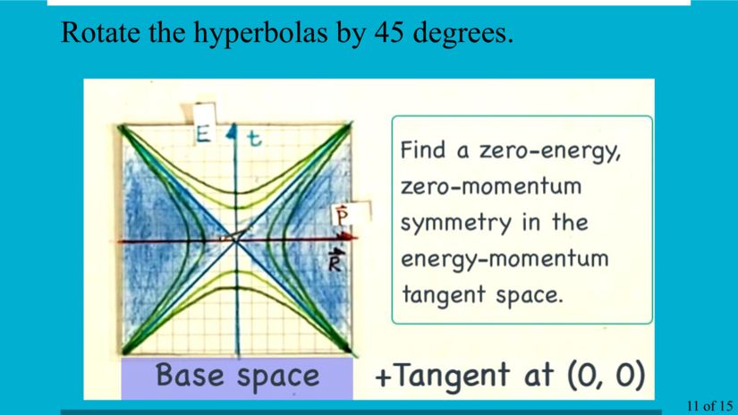

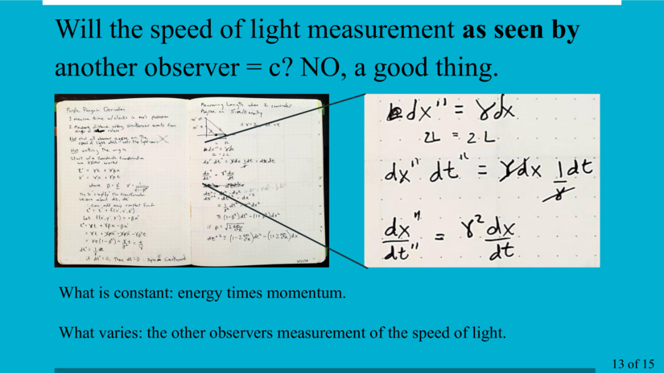
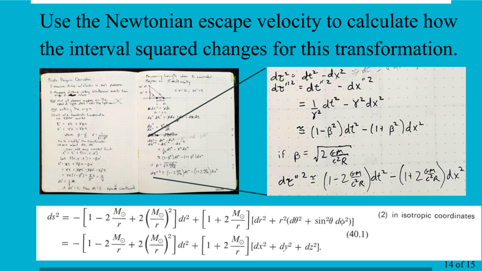
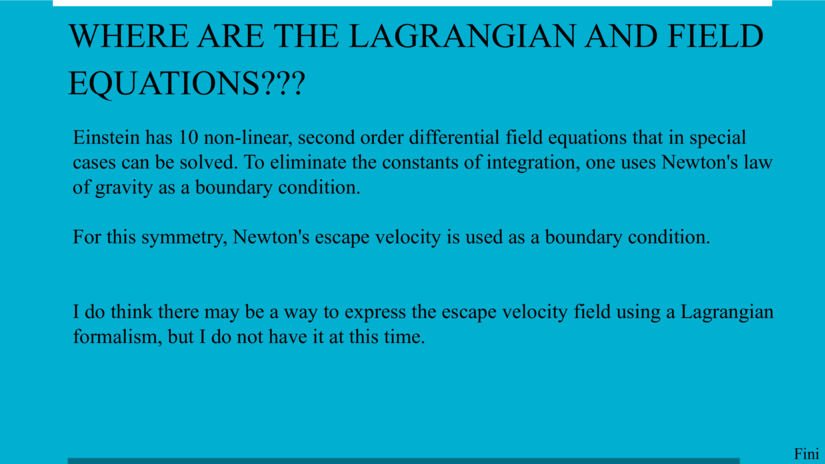

 
 
 

Doug Sweetser

sweetser@alum.mit.edu

All rights reserved, 2020
