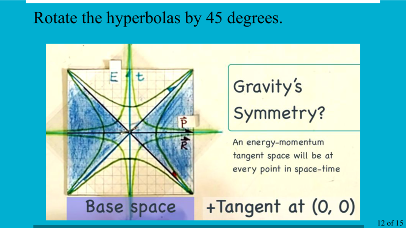

# Special Relativity in Space-Time and Gravity in its Tangent Space Energy-Momentum

A 24' talk for the virtual April APS Meeting, 2020. Approximately 20 people attended.

  <iframe width="640" height="360" src="https://www.youtube.com/embed/jIe4vQUVefM" frameborder="0" allowfullscreen></iframe>

[15 page PDF](Gravity_in_energy-momentum_v2.pdf)

Slides

Doug Sweetser
sweetser@alum.mit.edu
